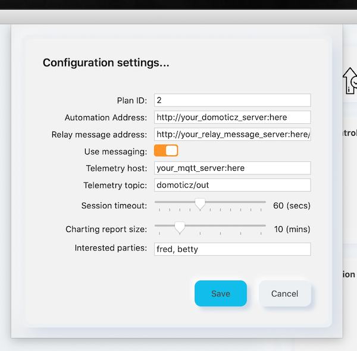
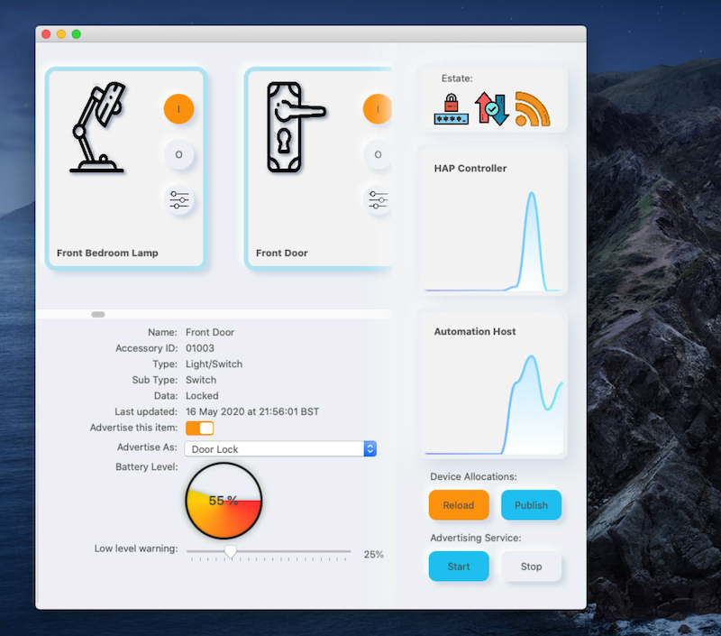
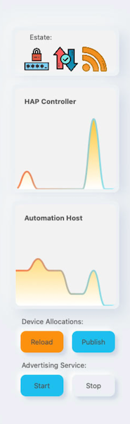
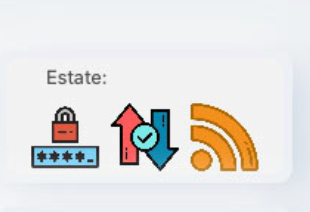

HomeBridge
===============

HomeBridge is a home kit bridge for use with Domoticz. HomeBridge is an application written using SwiftUI. 

I've spent a bit of time trying to make the interface pleasant to look at. Pleasant is an objective term we won't all agree with; so if you don't like my efforts, you're perfectly within your rights to change it.

Domoticz devices appear in the scrollable area at the top left of the main form. HomeKit can only handle 100 devices, so in Domoticz you will probably have to create a room plan that will work with the HAP advertiser. You can select which required room plan by entering the plan id (2, 3, 4, etc) in 'preferences'.

In preferences there are a number of items you will need to set:

## Configuration settings
### Automation address
The location of your Domoticz server

### Relay message address 
This is a messaging relay service. I wrote this in C# / Xamarin, it works on a mac (server) and it can message family members through iMessage when things happen that we need to know about. It can also be used to initiate server operations, starting and stopping a home media library (for instance). You can find the project here: <a href="https://github.com/thales-man/tiny-things" title="Tiny things">Tiny Things and the Mesage Relay Service</a>. The URL for this API works in a specific way, if you don't want it to use it...

### Use message relay
Enables you to turn message relaying off... (assuming you're not happy being told when there is a problem or if the battery is low in something.)

### Telemetry host 
The location of your MQTT host (probably Mosquitto, and on the same IP as Domoticz)

### Telemetry topic 
Always 'domoticz/out', don't change it. Not sure why I put this in as an option... I think you can focus the Domoticz MQTT topic, but I don't think it works properly. So, best just to leave it alone.

### Telemetry session timeout 
Defaults to 60 secs, I don't see any reason why you would need to touch this.

### Charting report size 
Number of data points in the chart (defaults to 10 mins, again, I think that's fine)

### Interested parties
This is a list of people used in the message relay. It's an array, but is presented and managed here as a comma delimited string.

Once you've saved the configuration, you should check your accessories.

## Accessory Settings
Whilst you can only inspect most of the values on your accessories, there are a couple of things you might able to set.

### The advertised type
The is how the device will be perceived in homekit. The applicaiton makes a valiant attempt at idenfiying the type of device Homekit can see; however, it this decision is not to your liking you can change it. Be sensitive to the fact that switches won't perform well if advertised as thermometers or motion sensors. See the avaiable list of items, I'm sure you'll get the picture.

### The low battery alert level
This is pretty self explanatory and the option will only appear where the application has detected a battery in the device. What you should be aware of is that if the low level alert is reached, the application will try and message you, to tell you so. If you don't have messaging configured, you will need to turn it off (in preferences).

## The service control area
This is the vertical bar that goes from top to bottom on the right hand side of the main form.

The estate icons at the top tell you about the bridge and it's current state. As a general policy, icons that are lit up are active. Hollow icons are inactive or signify off. From let to right these icons are indicators for:

### The paired state
If the bridge is paired this will light up once the service starts. If the bridge is not yet paired, a dialog will appear containg the QR Code and the setup code for the bridge. You will need to use one or the other of these to pair the bridge to the HAP controller. If pairing occurs, once paired this will ight up.

### The synchronisation state
The synchronisation state of the bridge indicates whether the number of accessories advertised is the number the HAP controller has recognised. This will light up once the bridge is paired, running and receiving requests from the HAP controller..

### The tranmission state
This tells you if comms are crossing the bridge. HAP controllers tend to go quiet, so this will pop on and off during normal use.

Next, the two charts show incoming comms from 
    the HAP controller 
    and MQTT telemetry from Domoticz.

If either of these show no activity for the 'reporting period' a 'klaxon alarm' icon will appear. However this isn't really an alarm, it's just an indicator to say we haven't heard from one or the other recently; this can happen and it's not a problem. Real issues with sockets / connections will be messaged out through the relay messaging service. The charts show the number of messages received per minute.  

Finally at the bottom of this area are buttons that do things.

### Load...
will load the device list. You will need to do this once you've configured the application. And... Consider doing this again, each time you add or remove something from the Domoticz room plan. Malconfiguration will result in a program error. I'll take a look at this and try to make it better.

### Publish...
needs to be done before you can start any services. And it will need to be done if you change the list of, or any setting pertaining to the devices you want 'bridged'.

### Start... 
the bridge (telemetry and advertising).  The advertiser won't start until the application is in receipt of some telemetry, at which point you will get an allow / deny dialog appear, so listening can start on the right ports for the HAP controller.

### Stop
does the opposite of Start...
    
If you make changes to your devices, you will need to stop the services before you can publish.

Note: You will need to install LibSodium, and instructions can be found on Bouke's <a href="https://github.com/Bouke/HAP" title="Home Automation Protocol">Home Automation Protocol (HAP)</a> project.

I intend to extend the range of bridged components (assuming Domoticz and HAP supports them) and I will be looking into the inclusion of RTSP cameras.

I think that's pretty much it. I've had this running in a Catalina VM on a High Sierra server for several weeks now and I'm happy it's working responsively and reliably. Next will be to remove all that node stuff off the PI.

Enjoy!

## Shoutouts...
I'd like to thank the following people / organisations for either their assistence in the production of or use of materials included in this project:

Bouke Haarsma
        => a special shoutout as Bouke made the whole thing possible with this excellent project the <a href="https://github.com/Bouke/HAP" title="Home Automation Protocol">Home Automation Protocol (HAP)</a>
    
Guy Brooker
        => as he does HAP stuff too and has been contributing to Bouke's HAP project.
    
Hint, tips and wrinkles supplied by...
        => <a href="https://www.hackingwithswift.com/" title="Hacking with Swift">Paul Hudson</a> of Hudson Heavy Industries (what a great name!)
    
And finally, the many sources on MQTT, neumorphic styling, line drawing and charting data, I thank you all.
    
Icons included in this project kindly made and supplied by  <a href="https://www.flaticon.com/authors/freepik" title="Freepik">Freepik</a> from <a href="https://www.flaticon.com/" title="Flaticon">www.flaticon.com</a>
